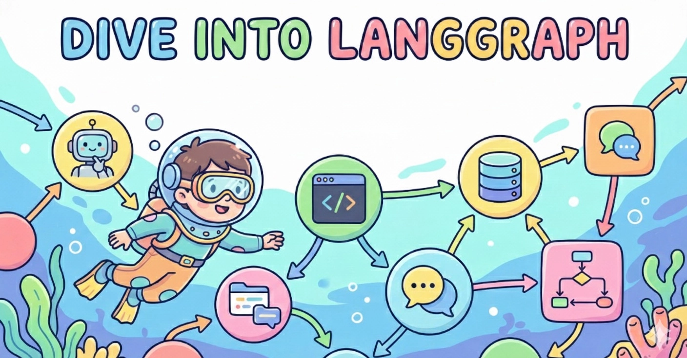

<div align="center">
  
  <h1>Dive into LangGraph</h1>
</div>

<div align="center">
  
  
  
  <a href="https://github.com/luochang212/dive-into-langgraph-en"></a>
  <a href="https://github.com/luochang212/dive-into-langgraph-en/actions/workflows/deploy-book.yml"></a>
</div>

<div align="center">

[Chinese](https://github.com/luochang212/dive-into-langgraph) | English

</div>

<div align="center">
  <p><a href="https://www.luochang.ink/dive-into-langgraph-en/">📚 Read Online</a></p>
  <h3>📖 LangGraph 1.0 Guide</h3>
  <p><em>Build powerful Agents from scratch</em></p>
</div>

---

## 1. Project Introduction

> In mid-October 2025, LangGraph released version 1.0. The development team promised this is a stable version, and the interfaces are not expected to change significantly in the future. Now is the perfect time to learn it.

This is an open-source e-book project aimed at helping Agent developers quickly master the LangGraph framework. [LangGraph](https://github.com/langchain-ai/langgraph) is an open-source Agent framework developed by the LangChain team. It is powerful and includes everything you need: Memory, MCP, Guardrails, State Management, and Multi-Agent support. LangGraph is typically used together with [LangChain](https://github.com/langchain-ai/langchain): LangChain provides foundational components and tools, while LangGraph handles workflow and state management. Therefore, both libraries need to be learned. To help everyone get started quickly, this tutorial extracts the main features of both libraries and divides them into 14 chapters.

## 2. Installation

```bash
pip install -r requirements.txt
```

<details>
  <summary>Dependency List</summary>

  Below is the list of dependencies in `requirements.txt`:

  ```text
  pydantic
  python-dotenv
  langchain[openai]
  langchain-community
  langchain-mcp-adapters
  langchain-text-splitters
  langgraph
  langgraph-cli[inmem]
  langgraph-supervisor
  langgraph-checkpoint-sqlite
  langgraph-checkpoint-redis
  langmem
  ipynbname
  fastmcp
  bs4
  scikit-learn
  supervisor
  jieba
  dashscope
  tavily-python
  ddgs
  ```
</details>

## 3. Table of Contents

Overview of this tutorial's content:

| No. | Chapter | Main Content |
| -- | -- | -- |
| 1 | [Quickstart](./1.quickstart.ipynb) | Create your first ReAct Agent |
| 2 | [StateGraph](./2.stategraph.ipynb) | Create workflows using StateGraph |
| 3 | [Middleware](./3.middleware.ipynb) | Use custom middleware to implement four features: budget control, message truncation, sensitive word filtering, and PII detection |
| 4 | [Human-in-the-loop](./4.human_in_the_loop.ipynb) | Implement human-in-the-loop using built-in HITL middleware |
| 5 | [Memory](./5.memory.ipynb) | Create short-term and long-term memory |
| 6 | [Context Engineering](./6.context.ipynb) | Manage context using State, Store, and Runtime |
| 7 | [MCP Server](./7.mcp_server.ipynb) | Create MCP Server and integrate with LangGraph |
| 8 | [Supervisor Pattern](./8.supervisor.ipynb) | Two methods to implement Supervisor Pattern: tool-calling and langgraph-supervisor |
| 9 | [Parallelization](./9.parallelization.ipynb) | How to implement concurrency: node parallelism, `@task` decorator, Map-reduce, and Sub-graphs |
| 10 | [RAG](./10.rag.ipynb) | Three ways to implement RAG: vector retrieval, keyword retrieval, and hybrid retrieval |
| 11 | [Web Search](./11.web_search.ipynb) | Implement web search: DashScope, Tavily, and DDGS |
| 12 | [Deep Agents](./12.deep_agents.ipynb) | Brief introduction to Deep Agents |
| 13 | [Gradio APP](./13.gradio_app.ipynb) | Develop a streaming conversational Agent application based on Gradio |
| 14 | [Appendix: Debug Page](./14.langgraph_cli.ipynb) | Introduce the debug page provided by langgraph-cli |

> [!NOTE]
>
> **Promise**: This tutorial is entirely based on LangGraph v1.0, with no legacy code from v0.6.

## 4. Debug Page

`langgraph-cli` provides a debug page that can be launched quickly.

```bash
langgraph dev
```

See details: [Appendix: Debug Page](https://www.luochang.ink/dive-into-langgraph-en/langgraph-cli/)

## 5. Practical Chapter

[Chapter 13](https://www.luochang.ink/dive-into-langgraph-en/gradio-app/) open-sources an Agent application implemented with Gradio + LangChain. The effect is shown below. You can add more features to this application and customize your own Agent.


See details: [/app](./app/)

## 6. Further Reading

**Official Documentation:**

- [LangChain](https://docs.langchain.com/oss/python/langchain/overview)
- [LangGraph](https://docs.langchain.com/oss/python/langgraph/overview)
- [Deep Agents](https://docs.langchain.com/oss/python/deepagents/overview)
- [LangMem](https://langchain-ai.github.io/langmem/)

**Official Tutorials:**

- [langgraph-101](https://github.com/langchain-ai/langgraph-101)
- [langchain-academy](https://github.com/langchain-ai/langchain-academy)

## 7. How to Contribute

We welcome any form of contribution!

- 🐛 Report Bugs - Submit an Issue if you find any problems
- 💡 Feature Suggestions - Let us know if you have good ideas
- 📝 Content Improvement - Help improve the tutorial content
- 🔧 Code Optimization - Submit Pull Requests

## 8. License

This work is licensed under the [Creative Commons Attribution-NonCommercial-ShareAlike 4.0 International License](http://creativecommons.org/licenses/by-nc-sa/4.0/).
