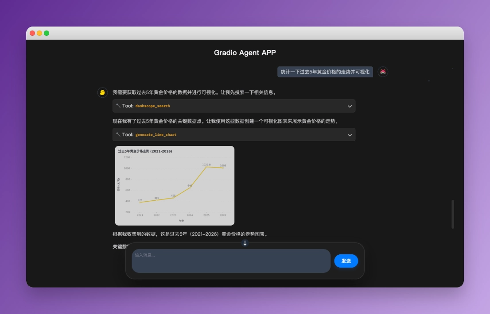

# Practical: Build a Streaming Conversational Agent App with LangChain

English | [中文](./docs/README.md)



> A super practical Agent web app. Fully local deployment, full control over architecture and compute, squeezing the most out of your LLM.

## 💻 Tech Stack

- **Frontend**: `Gradio`
- **Backend**:
    - `LangChain`
    - `LangGraph`
- **MCP**: `fastmcp`

## 🔧 Toolset

- **tools**:
    - **Web search**: [tool_search](./tools/tool_search.py)
    - **Math**: [tool_math](./tools/tool_math.py)
    - **Scientific computing**: [tool_sci](./tools/tool_sci.py)
    - **Role-play**: [role-play](./tools/tool_role.py)
- **MCP**:
    - **Code execution**: [code-execution](./mcp/code_execution.py)
    - **Chart visualization**: [mcp-server-chart](./mcp/mcp-server-chart/README.md)
    - **AMap (Gaode Maps)**: [amap-maps](https://lbs.amap.com/api/mcp-server/summary)
    - **Filesystem**: [filesystem](https://github.com/modelcontextprotocol/servers/tree/main/src/filesystem)
- **Middleware**:
    - **Dynamic system prompt**: [dynamic_prompt](https://reference.langchain.com/python/langchain/middleware/#langchain.agents.middleware.dynamic_prompt)
    - **Todo list**: [TodoListMiddleware](https://reference.langchain.com/python/langchain/middleware/#langchain.agents.middleware.TodoListMiddleware)
    - **Conversation summarization**: [SummarizationMiddleware](https://reference.langchain.com/python/langchain/middleware/#langchain.agents.middleware.SummarizationMiddleware)

> \[!NOTE\]
>
> The **Chart visualization**, **AMap**, and **Filesystem** MCPs are disabled by default. To enable them, uncomment the corresponding sections in [app.py](./app.py). Additionally, for AMap, you need to apply for an `API_KEY` from the [AMap Open Platform](https://lbs.amap.com/api/mcp-server/create-project-and-key) and configure it in the `.env` file.

<!-- ## 👷 Skills -->

## 🚀 Getting Started

**Prerequisites:** `Python ≥ 3.10`

### 1) Configure environment variables

Create a `.env` file:

```bash
cp .env.example .env
```

Then register for [Alibaba Cloud Bailian](https://bailian.console.aliyun.com/?tab=model#/model-market), get an `API_KEY`, and set it in the `.env` file.

### 2) Start the Agent and MCP Server

Install dependencies with uv and start the app:

```bash
# 1. Install uv
pip install uv -U

# 2. Sync the virtual environment with uv
uv sync

# 3. Run the app with uv
uv run app.py
```

<details>
  <summary>If uv installation fails, you can use pip</summary>
  
  ```bash
  # 1. Install dependencies
  pip install -r requirements.txt -U -i https://mirrors.cloud.tencent.com/pypi/simple/
  # Notes:
  #   -i uses a mirror (full name: --index-url)
  #   -U upgrades to the latest versions (full name: --upgrade)

  # 2. Run the app
  python app.py
  ```
  
</details>

## 🐒 Test Questions

- The goddess is ignoring me, how to win her back
- Help me develop code to calculate which years in the past 50 years are leap years, and actually run the test
- What's the weather like in Nanjing today
- Search for Shanghai's temperature over the past seven days, then visualize it
- How to get from Longfu Temple to Solana
- 6195 - 498 * 3823 =
- Analyze the performance of CSI 300 ETF last year and provide a report. The content should include current valuation, whether current price is high or low relative to valuation, main force behavior, recent implied volatility performance, impact of hot events, etc. Think of other angles yourself. Must use todo list to plan tasks.
- Deeply analyze the plot of Ave Mujica, analyze where the tear-jerking moments are, and generate a report. Please use todo list to plan tasks. Each task needs to be analyzed using subagent.

> See full test list at [query.md](./docs/query.md)

## 🔭 Architecture

```text
.
├── Dockerfile
├── README.md               # Project overview
├── app.py                  # Main app entry
├── .env.example            # Example environment variables
├── config                  # Config module
│   ├── __init__.py
│   └── mcp_config.py       # MCP configuration
├── docker-compose.yml
├── docker.conf
├── docs                    # Documentation
├── images                  # Image assets
├── logs                    # Logs
├── mcp                     # MCP module
│   ├── code_execution.py
│   └── mcp-server-chart
│       └── README.md
├── prompts                 # System prompts
│   ├── __init__.py
│   ├── middleware_todolist.py
│   ├── prompt_base.py
│   ├── prompt_enhance.py
│   └── subagent_search.py
├── pyproject.toml
├── requirements.txt        # Dependencies
├── space                   # Filesystem read/write space
│   └── food.md
├── tests                   # Tests
├── tools                   # Tools
│   ├── __init__.py
│   ├── tool_math.py
│   ├── tool_role.py
│   ├── tool_runtime.py
│   └── tool_search.py
├── utils                   # Utility scripts
│   ├── __init__.py
│   ├── device_info.py
│   ├── fix_dashscope.py
│   ├── fix_deepseek.py
│   ├── remove_html.py
│   ├── think_view.py
│   ├── tool_view.py
│   └── web_ui.py
└── uv.lock
```

## 📦 Container Deployment

Before starting containers, make sure you've configured the `.env` file.

### 1) Start the app

```bash
docker compose up -d
```

After initialization, open in your browser: [http://localhost:7860/](http://localhost:7860/)

### 2) Debug commands

```bash
# List running containers
docker ps

# View logs for the gradio-agent-container container
docker logs gradio-agent-container -f

# Stop and remove all containers for this project
docker compose down

# Stop and remove all containers and local images for this project
docker compose down --rmi local

# Rebuild the image and start in the background
docker compose up -d --build

# Enter the container bash shell
docker compose exec -it gradio-agent bash
```

## 🌱 Dependency Management

```bash
# 1. Make sure uv is installed
pip install uv -U

# 2. Initialize the project (creates a pyproject.toml with basic info)
uv init --name gradio-agent-app --description "Streaming conversational agent built with LangChain" --python 3.13

# 3. Update the dependencies section in pyproject.toml
# This creates a .venv virtual environment and an uv.lock file
uv add -r requirements.txt
```

## 📢 More Information

Find more information about this project here:

- ["LangGraph 1.0 Complete Guide" Chapter 13](https://www.luochang.ink/dive-into-langgraph/gradio-app/)
- ["Building a Home Agent Service on Raspberry Pi"](https://www.luochang.ink/posts/rpi_agent_server/)

## 📝 Changelog

- [x] **Improved frontend UI**: improved input box; improved ChatBot slider, margins, tool-call display, text bubbles; improved background color
- [x] **Enhanced MCP**: added role-play MCP, code execution MCP, AMap MCP, chart visualization MCP, filesystem MCP
- [x] **Enhanced middleware**: added todo-list middleware; added conversation summarization middleware
- [x] **Context engineering**: pass sensitive info like API_KEY losslessly via runtime
- [x] **Multi-agent**: provide subagents with independent context and search capability
- [x] **Standalone prompt modules**: multiple system prompts; can inject current time, username, OS info, etc.
- [x] **Dynamic system prompt**: update system prompt per query; time awareness down to the second
- [x] **Error handling**: add LLM call timeout; enable LLM call retries; MCP failures won't exit and will be summarized
- [x] **Welcome message**: show all tool (including MCP) names and descriptions when opening the app; show only names if too many tools
- [x] **Chain-of-thought capture**: developed [DashScopeChatOpenAI](./utils/fix_dashscope.py) for DashScope API to capture chain-of-thought
- [x] **Tool-call UI optimization**: developed `_agent_events_optimize` in [app.py](./app.py) to optimize tool/MCP input-output display
- [x] **Remove HTML tags from chat history**: remove HTML introduced for UI optimization to reduce context load
- [x] **Local model support**: added instructions for deploying local models with Ollama in [ollama.md](./docs/ollama.md)
- [x] **Container deployment support**: one-click deployment via docker compose
- [x] **Enhanced error handling**: use traceback for detailed error info to improve LLM summary accuracy
- [x] **New config module**: added [config](./config) module for storing MCP configuration
