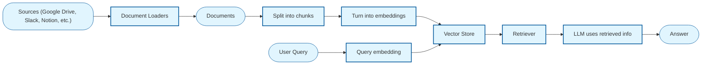
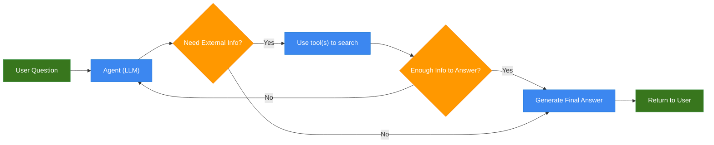
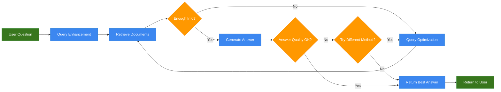

# RAG

Large language models have training data cutoff dates, so they don't know about events after that date. Additionally, their parameter limits prevent them from containing all professional knowledge. In other words, LLMs lack both real-time capabilities and specialized expertise.

How can we make LLMs both real-time and professional? The easiest method is to let them "cheat with notes." A **knowledge base** is like "cheat notes" for an LLM. Before answering a question, it first checks the notes to see if there's any content related to the question. If there is, it retrieves that content and combines it with the LLM's reasoning ability to generate the final answer.

This "checking notes" action is [**RAG**](https://docs.langchain.com/oss/python/langchain/retrieval) (Retrieval-Augmented Generation).

> **Note**
>
> Using a knowledge base can make LLM responses evidence-based and reduce hallucinations, but the cost is the overhead of building and maintaining the knowledge base. Especially when the knowledge base is large, it's worth considering whether the cost is justified. After all, expanding the knowledge base to improve Agent performance is somewhat like "using the finite to fight the infinite, using the certain to fight the uncertain." Although we often mention knowledge bases when talking about RAG, RAG is a retrieval technique that can retrieve anything. Compared to retrieving manually built knowledge bases, retrieving internet content or historical conversations is also possible and offers better value. Your next retrieval target doesn't necessarily have to be a knowledge base.

## 1. Prompt Template

RAG is not complicated. It retrieves content related to the user's question from the knowledge base and injects it as context into a **Prompt Template**.

Here is a prompt template:

```text
{context}

---

Based on the context provided above, answer the question.

Question: {question}

Answer: 
```

When using this template, fill `{context}` with the retrieved text and `{question}` with the user's question. Then pass the filled prompt template to the LLM for inference.

RAG mainly does two things: first, **retrieving** text related to the user's question from the knowledge base, and second, **concatenating** the retrieved text with the user's question using a prompt template. Concatenation is easy; the difficulty lies mainly in retrieval. In the next section, I'll introduce how to retrieve text related to the user's question.

### 2.1 Text Vectorization

Embedding is a technique that converts text into vectors. It takes a piece of text as input and outputs a fixed-length vector.

```
"I really like you" --> [0.190012, 0.123555, .... ]
```

The purpose of converting text to vectors is to map semantically similar words to the same vector space. Therefore, after converting a pair of synonyms into vectors, their vector distance is usually closer than other words. For example, "football" and "basketball" are closer in vector space, while "football" and "basket" are farther apart. The essence of Embedding is compression. From an encoding perspective, natural language contains redundant information. Embedding is equivalent to re-encoding natural language, expressing the most semantics with the fewest tokens.

Embedding also has advantages in multilingual scenarios. A well-trained Embedding model aligns multilingual content at the semantic level. That is, a vector can maintain the same semantics across multiple languages. This characteristic allows LLMs to be inclusive. Even when multilingual materials are added, they won't cause "understanding" confusion due to different literal words.

### 2.2 Vector Retrieval Principles

Since Embedding models have the characteristic of training semantically similar words into nearby vectors, we can convert both the "user question" and "knowledge base content" into Embedding vectors. Then we calculate the distance between vectors. The smaller the vector distance, the higher the similarity between the texts. Using this principle, we can return the Top-K documents from the knowledge base with the smallest vector distance to the question vector.

Let's verify with a simple experiment whether this calculation method can obtain truly relevant text.

```python
from dotenv import load_dotenv
from langchain_community.embeddings import DashScopeEmbeddings
from sklearn.metrics.pairwise import cosine_similarity

# Load environment variables
_ = load_dotenv()
```

Below we calculate the similarity between each document in the knowledge base and the question to see if semantically similar content has higher cosine similarity.

```python
# User question
query = "Should I give red envelopes to relatives I'm not close with during New Year?"

# Knowledge base
docs = [
    "Don't give money to people you don't interact with",
    "Sea urchin tofu is delicious, will eat again",
    "Medium-rare steak drizzled with undercooked cheese",
]

# Initialize embedding generator
embeddings = DashScopeEmbeddings()

# Generate vectors
qv = embeddings.embed_query(query)
dv = embeddings.embed_documents(docs)

# Calculate cosine similarity
similarities = cosine_similarity([qv], dv)[0]
results = list(enumerate(similarities))
by_sim = sorted(results, key=lambda r: r[1], reverse=True)

# Higher cosine similarity -> smaller angle between unit vectors -> vectors are closer
print("Sorted by cosine similarity:")
for i, s in by_sim:
    print('-', docs[i], s)
```

## 3. Vector Retrieval Pipeline

Although the above code can already calculate the similarity between knowledge base content and user questions, there are some issues in the engineering process:

- **Issue 1**: Embedding models have input length limits, and long text itself affects vector representation
- **Issue 2**: When the knowledge base is large, it's difficult to quickly retrieve Top-K relevant texts

To solve **Issue 1**, we need text chunking: splitting the text in the knowledge base into uniformly sized chunks. Then use the Embedding model to convert these chunks into Embedding vectors. To ensure chunks don't lose semantics due to truncation, adjacent chunks should have some overlap. **Issue 2** is generally solved by introducing vector databases, which have mature [ANN](https://milvus.io/docs/single-vector-search.md) algorithms to help us quickly retrieve nearest neighbor vectors.

After engineering, our retrieval process becomes more complex. Here is a typical [vector retrieval pipeline](https://docs.langchain.com/oss/python/langchain/retrieval#retrieval-pipeline):



*\* Rounded boxes represent data, square boxes represent components.*

Since LangChain uses a modular approach, each component is replaceable. The bold parts below list the components in the diagram, with replaceable variants on the right:

- **Document Loader**: `TextLoader`, `PyMuPDFLoader`, `WebBaseLoader`
- **Document Splitter**: `RecursiveCharacterTextSplitter`
- **Embedding Generation**: `DashScopeEmbeddings`, `HuggingFaceEmbeddings`
- **Vector Store**: `Chroma`, `Milvus`, `FAISS`
- **Retriever**: `EnsembleRetriever`, `BM25Retriever`
- **LLM**: `ChatOpenAI`

In the next section, we'll implement a vector retrieval pipeline containing all the above components.

## 4. RAG Based on Vector Retrieval

☝️🤓 Just six steps to implement a RAG based on vector retrieval.

```python
import os

# Configure UA
MY_USER_AGENT = (
    "Mozilla/5.0 (Macintosh; Intel Mac OS X 10_15_7) AppleWebKit/605.1.15 "
    "(KHTML, like Gecko) Version/17.0 Safari/605.1.15"
)
os.environ["USER_AGENT"] = MY_USER_AGENT

import bs4

from dotenv import load_dotenv
from langchain_openai import ChatOpenAI
from langchain_community.document_loaders import WebBaseLoader
from langchain_text_splitters import RecursiveCharacterTextSplitter
from langchain_community.embeddings import DashScopeEmbeddings
from langchain_core.vectorstores import InMemoryVectorStore
from langchain.tools import tool
from langchain.agents import create_agent

# Load model configuration
_ = load_dotenv()

# Load model
llm = ChatOpenAI(
    model="qwen3-max",
    api_key=os.getenv("DASHSCOPE_API_KEY"),
    base_url=os.getenv("DASHSCOPE_BASE_URL"),
)
```

Use `WebBaseLoader` to load the content of ["Alibaba Releases New Quick BI: Discussing ChatBI's Underlying Architecture, Interaction Design, and Cloud Computing Ecosystem" (阿里发布新版 Quick BI，聊聊 ChatBI 的底层架构、交互设计和云计算生态)](https://luochang212.github.io/posts/quick_bi_intro/).

```python
# Load article content
bs4_strainer = bs4.SoupStrainer(class_=(["post"]))
loader = WebBaseLoader(
    web_paths=(["https://luochang212.github.io/posts/quick_bi_intro/"]),
    bs_kwargs={"parse_only": bs4_strainer},
    requests_kwargs={"headers": {"User-Agent": MY_USER_AGENT}},
)
docs = loader.load()

assert len(docs) == 1

print(f"Total characters: {len(docs[0].page_content)}")
print(docs[0].page_content[:248])
```

### 4.2 Split Documents

Use `RecursiveCharacterTextSplitter` to split the text into chunks for subsequent Embedding calculation.

```python
# Text chunking
text_splitter = RecursiveCharacterTextSplitter(
    chunk_size=1000,  # chunk size (characters)
    chunk_overlap=200,  # chunk overlap (characters)
    add_start_index=True,  # track index in original document
)
all_splits = text_splitter.split_documents(docs)

print(f"Split blog post into {len(all_splits)} sub-documents.")
```

### 4.3 Vector Generation

Note that both user questions and the knowledge base must use the same Embedding model to generate vectors.

```python
# Initialize embedding generator
embeddings = DashScopeEmbeddings()
```

### 4.4 Vector Store

Here we only use `InMemoryVectorStore` for demonstration. For production projects, please use vector databases like Chroma or Milvus.

```python
# Initialize in-memory vector store
vector_store = InMemoryVectorStore(embedding=embeddings)

# Add documents to vector store
document_ids = vector_store.add_documents(documents=all_splits)

print(document_ids[:2])
```

### 4.5 Create Tool

Create a tool that can be called by the Agent. This tool retrieves `k=2` text chunks most similar to the `query` from the vector store.

```python
# Create context retrieval tool
@tool(response_format="content_and_artifact")
def retrieve_context(query: str):
    """Retrieve information to help answer a query."""
    retrieved_docs = vector_store.similarity_search(query, k=2)
    serialized = "\n\n".join(
        (f"Source: {doc.metadata}\nContent: {doc.page_content}")
        for doc in retrieved_docs
    )
    return serialized, retrieved_docs
```

### 4.6 Retrieve Text

Use the Agent to call the retrieval tool and retrieve context related to the question.

```python
# Create ReAct Agent
agent = create_agent(
    llm,
    tools=[retrieve_context],
    system_prompt=(
        # If desired, specify custom instructions
        "You have access to a tool that retrieves context from a blog post. "
        "Use the tool to help answer user queries."
    )
)

# Invoke Agent
response = agent.invoke({
    "messages": [{"role": "user", "content": "What are the current limitations of Agent capabilities?"}]
})

# # Get Agent's complete response
# for message in result["messages"]:
#     message.pretty_print()
```

```python
# Get Agent's final response
response['messages'][-1].pretty_print()
```

## 5. Keyword Retrieval

[BM25](https://en.wikipedia.org/wiki/Okapi_BM25) is a term frequency-based ranking algorithm that can estimate the relevance between documents and a given query. Given a query $Q$ containing keywords $q_1, ..., q_n$, the BM25 score of document $D$ is:

$$\\text{score}(D, Q) = \\sum\_{i=1}^{n} \\text{IDF}(q_i) \\cdot \\frac{f(q_i, D) \\cdot (k_1 + 1)}{f(q_i, D) + k_1 \\cdot \\left( 1 - b + b \\cdot \\frac{|D|}{\\text{avgdl}} \\right)}$$

Where:

- $f(q_i, D)$: The number of times keyword $q_i$ appears in document $D$
- $|D|$: The word count of document $D$
- $avgdl$: The average document length in the collection
- $k_1$: Tunable parameter for controlling term frequency saturation, typically $k_1 \\in [1.2, 2.0]$
- $b$: Tunable parameter for controlling document normalization, typically $b = 0.75$
- $\\text{IDF}(q_i)$: The IDF (Inverse Document Frequency) weight of keyword $q_i$, measuring how common a word is; more common words have lower values

For Chinese keyword retrieval, you need to install a Python package that supports word segmentation:

```python
# !pip install jieba
```

### 5.1 Create Retriever

We use LangChain's [BM25Retriever](https://docs.langchain.com/oss/python/integrations/retrievers/bm25) to create a retriever and use jieba as its tokenizer.

```python
import jieba

from langchain_community.retrievers import BM25Retriever
from langchain_core.documents import Document
```

```python
def chinese_tokenize(text: str) -> list[str]:
    """Chinese word segmentation function"""
    tokens = jieba.lcut(text)
    return [token for token in tokens if token.strip()]

# 1. Create Chinese retriever using text
text_retriever = BM25Retriever.from_texts(
    [
        "What does it mean",
        "That's bad",
        "This small matter doesn't matter",
        "I forgive you on her behalf",
    ],
    k=2,
    preprocess_func=chinese_tokenize,
)

# 2. Create Chinese retriever using documents
doc_retriever = BM25Retriever.from_documents(
    [
        Document(page_content="Stir-fried pork with chili noodles"),
        Document(page_content="Meat, egg, and green onion chicken"),
        Document(page_content="Now it's not familiar"),
        Document(page_content="Iron skewers"),
    ],
    k=2,
    preprocess_func=chinese_tokenize,
)
```

### 5.2 Use Retriever

```python
# Retrieve text
text_retriever.invoke("A small matter")
```

```python
# Retrieve documents
doc_retriever.invoke("Noodles")
```

### 6.1 RRF Score

**RRF** (Reciprocal Rank Fusion) is a classic reranking solution. You can use RRF to integrate scores from multiple retrievers to calculate the final ranking of text chunks.

The RRF score of a text chunk can be calculated by the following formula:

$$\\text{RRF} = \\sum\_{i} \\frac{w_i}{k + r_i}$$

Where:

- $w_i$: Weight of the $i$-th retriever, default value is $1.0$
- $k$: Smoothing parameter, default value is $60$
- $r_i$: Ranking of the document in the $i$-th retriever

Hybrid retrieval based on RRF scores can be implemented through vector databases. For details, see the documentation, which won't be elaborated here:

- [Milvus](https://milvus.io/docs/multi-vector-search.md)
- [Chroma](https://docs.trychroma.com/cloud/search-api/hybrid-search)

### 6.2 Agentic Hybrid Search

According to first principles, if using a large model can achieve better reranking results, why calculate RRF scores? Below we write some experimental code to verify the effect of using a large model for reranking.

```python
import random
from typing import List
from pydantic import BaseModel, Field

# This is the user query
query = "Sea otter black history collection"

# These are text chunks retrieved by vector retrieval
dense_texts = [
    "Some marine creatures litter",
    "Sea otters are so cute",
    "Sea otters smell bad",
]

# These are text chunks retrieved by keyword retrieval
sparse_texts = [
    "Sea otters smell bad",
    "Snowy owl black history",
]

# Define Agent output format
class ReRankOutput(BaseModel):
    indices: List[int] = Field(description="List of indices of recalled text fragments after reranking")

# Return at most limit text chunks
def get_relevant_texts(query: str,
                       dense_texts: list,
                       sparse_texts: list,
                       limit: int = 3):

    # Create context
    texts = dense_texts + sparse_texts

    # Remove duplicates
    texts = list(set(texts))

    # Shuffle to eliminate position bias
    random.shuffle(texts)

    # Explicitly add index id before text chunks
    texts_with_index = [f"{i} - {text}" for i, text in enumerate(texts)]

    context = '\n\n'.join(texts_with_index)
    prompt = "\n".join([
        f"{context}",
        "---",
        "Above are multiple text fragments recalled by RAG. Each fragment is in the format [index] - [content].",
        f"Please return at most {limit} indices of text fragments related to the user question (if relevant content is insufficient, fewer than {limit} is allowed).",
        "\nNotes:",
        "1. Text fragments with higher relevance should be ranked first",
        "2. Returned text fragments must help answer the user question!",
        f"\nUser question: {query}",
        "List of text fragment indices:",
    ])

    # Create Agent with structured output
    agent = create_agent(
        model=llm,
        system_prompt="You are a retrieval text relevance reranking assistant",
        response_format=ReRankOutput,
    )

    # Invoke Agent
    result = agent.invoke(
        {"messages": [{"role": "user", "content": prompt}]},
    )

    indices = result['structured_response'].indices
    return [texts[i] for i in indices]
```

Call the retrieval text relevance reranking assistant to get the reranked relevance text list.

```python
res = get_relevant_texts(
    query,
    dense_texts,
    sparse_texts,
)

res
```

## 7. RAG Architectures

### 7.1 2-Step RAG


### 7.2 Agentic RAG



### 7.3 Hybrid RAG



References:

- [All-in-RAG](https://datawhalechina.github.io/all-in-rag/#/chapter4/11_hybrid_search)
- [Multi-Vector Hybrid Search](https://milvus.io/docs/multi-vector-search.md)
- [Hybrid Search with RRF](https://docs.trychroma.com/cloud/search-api/hybrid-search)
