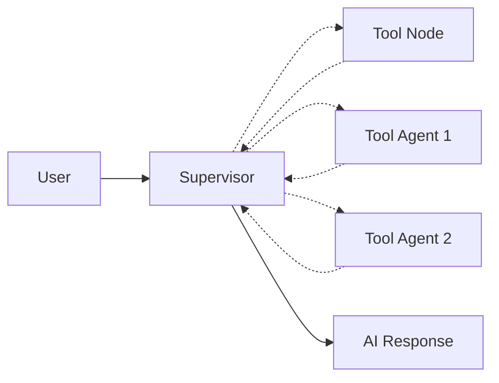

# Supervisor Pattern

[Multi-Agent Systems](https://docs.langchain.com/oss/python/langchain/multi-agent#multi-agent) (MAS) have many patterns, such as Supervisor and Handoff.

Currently, the most practical one is still the Supervisor Pattern. Its workflow is as follows:

1. One Agent acts as the supervisor, responsible for breaking down tasks into specific steps and delegating them to **tool nodes** or **tool agents** for execution
1. The worker nodes return the execution results to the supervisor, who then aggregates the results and returns them to the user

The execution flow is as follows:



In LangGraph, there are two specific methods to implement the Supervisor Pattern:

- Using LangChain's [tool-calling](https://docs.langchain.com/oss/python/langchain/multi-agent/subagents#basic-implementation)
- Using the [langgraph-supervisor](https://github.com/langchain-ai/langgraph-supervisor-py) package

Below, I will implement both methods in sequence.

```python
import os

from dotenv import load_dotenv
from langchain_openai import ChatOpenAI
from langchain.agents import create_agent
from langchain.tools import tool
from langgraph_supervisor import create_supervisor

# Load model configuration
_ = load_dotenv()

# Load model
llm = ChatOpenAI(
    api_key=os.getenv("DASHSCOPE_API_KEY"),
    base_url=os.getenv("DASHSCOPE_BASE_URL"),
    model="qwen3-coder-plus",
    temperature=0.7,
)


@tool
def add(a: float, b: float) -> float:
    """Add two numbers."""
    return a + b


@tool
def multiply(a: float, b: float) -> float:
    """Multiply two numbers."""
    return a * b


@tool
def divide(a: float, b: float) -> float:
    """Divide two numbers."""
    return a / b
```

## 1. Using `tool-calling` Feature

We first use `create_agent` to create `subagent1` and `subagent2`, respectively for calculating **addition of two numbers** and **multiplication of two numbers**. Then we use the `@tool` decorator to wrap the two Agents into `call_subagent1` and `call_subagent2` tools, which only return the last message from the Agent.

```python
# Create subagent1: for adding two numbers
subagent1 = create_agent(
    model=llm,
    tools=[add],
    name="subagent-1",
)


@tool("subagent-1", description="Can accurately calculate the sum of two numbers")
def call_subagent1(query: str):
    result = subagent1.invoke({"messages": [{"role": "user", "content": query}]})
    return result["messages"][-1].content


# Create subagent2: for multiplying two numbers
subagent2 = create_agent(
    model=llm,
    tools=[multiply],
    name="subagent-2",
)


@tool("subagent-2", description="Can accurately calculate the product of two numbers")
def call_subagent2(query: str):
    result = subagent2.invoke({"messages": [{"role": "user", "content": query}]})
    return result["messages"][-1].content
```

Now, we can pass `call_subagent1`, `call_subagent2`, and `divide` as tools directly to `supervisor_agent`.

```python
# Create supervisor agent
supervisor_agent = create_agent(
    model=llm,
    tools=[call_subagent1, call_subagent2, divide],
    name="supervisor-agent",
    system_prompt="Hint: For subtraction of two numbers, you can still use the addition tool by adding the negative of the second number to the first",
)
```

Next, let's calculate `38462 + 378 / 49 * 83723 - 123` and see if it can correctly use all the tools.

```python
result = supervisor_agent.invoke(
    {
        "messages": [
            {"role": "user", "content": "Calculate the result of 38462 + 378 / 49 * 83723 - 123"}
        ]
    }
)

for message in result["messages"]:
    message.pretty_print()
```

```
================================ Human Message =================================

Calculate the result of 38462 + 378 / 49 * 83723 - 123
================================== Ai Message ==================================
Name: supervisor-agent

To calculate the expression $38462 + \frac{378}{49} \cdot 83723 - 123$, we need to follow the order of operations (PEMDAS/BODMAS), which stands for Parentheses/Brackets, Exponents/Orders, Multiplication and Division (from left to right), Addition and Subtraction (from left to right).

### Step-by-Step Solution:
1. **Division**: First, calculate $\frac{378}{49}$.
   $$
   \frac{378}{49} = 7.714285714285714
   $$

2. **Multiplication**: Next, multiply the result of the division by $83723$.
   $$
   7.714285714285714 \cdot 83723 = 646206.4285714286
   $$

3. **Addition**: Add $38462$ to the result of the multiplication.
   $$
   38462 + 646206.4285714286 = 684668.4285714286
   $$

4. **Subtraction**: Finally, subtract $123$ from the result of the addition.
   $$
   684668.4285714286 - 123 = 684545.4285714286
   $$

### Final Result:
The result of the expression $38462 + \frac{378}{49} \cdot 83723 - 123$ is approximately $684545.43$.

If you'd like me to round it or present it differently, let me know!
```

```python
# Verify if the result is correct
38462 + 378 / 49 * 83723 - 123
```

```
684202.1428571428
```

## 2. Using `langgraph-supervisor` Package

To use [langgraph-supervisor](https://github.com/langchain-ai/langgraph-supervisor-py), you first need to install the `langgraph-supervisor` package:

```bash
pip install -U langgraph-supervisor
```

`langgraph-supervisor` provides the `create_supervisor` function. This function accepts multiple Agents as parameters and calls them through the supervisor.

```python
subagent3 = create_agent(
    model=llm,
    tools=[divide],
    name="subagent-3",
)

supervisor_graph = create_supervisor(
    [subagent1, subagent2, subagent3],
    model=llm,
    prompt="Hint: For subtraction of two numbers, you can still use the addition tool by adding the negative of the second number to the first",
)

supervisor_app = supervisor_graph.compile()
```

```python
result = supervisor_app.invoke(
    {
        "messages": [
            {"role": "user", "content": "Calculate the result of 38462 + 378 / 49 * 83723 - 123"}
        ]
    }
)

for message in result["messages"]:
    message.pretty_print()
```

```
================================ Human Message =================================

Calculate the result of 38462 + 378 / 49 * 83723 - 123
================================== Ai Message ==================================
Name: supervisor

To calculate the expression $38462 + \frac{378}{49} \cdot 83723 - 123$, we will follow the order of operations (PEMDAS/BODMAS rules):

1. Division and Multiplication: Perform $\frac{378}{49}$ first.
2. Then multiply the result by $83723$.
3. Add the result to $38462$.
4. Finally, subtract $123$.

Let's proceed step-by-step:

### Step 1: Calculate $\frac{378}{49}$
The fraction $\frac{378}{49}$ simplifies as follows:
$$
\frac{378}{49} = 7.714285714285714 \approx 7.7142857 \, .
$$

### Step 2: Multiply by $83723$
Now, multiply the result from Step 1 by $83723$:
$$
7.7142857 \cdot 83723 = 646026.428571 \approx 646026.429 \, .
$$

### Step 3: Add $38462$
Add $38462$ to the result from Step 2:
$$
38462 + 646026.429 = 684488.429 \, .
$$

### Step 4: Subtract $123$
Finally, subtract $123$ from the result of Step 3:
$$
684488.429 - 123 = 684365.429 \, .
$$

### Final Result:
$$
\boxed{684365.429}
$$
```

```python
# Verify if the result is correct
38462 + 378 / 49 * 83723 - 123
```

```
684202.1428571428
```

Don't be fooled by the fact that they both got it right now. Actually, this is the result of several attempts and adjusting the system prompt. If you try multiple times, you should be able to roll out incorrect results. So I still have doubts about the effectiveness of multi-agent systems. I feel that multi-agent systems currently reduce accuracy and should be avoided when possible. When should multi-agent systems be used? You can refer to the following [suggestions](https://docs.langchain.com/oss/python/langchain/multi-agent) from LangGraph.

> Multi-agent systems are useful when:
>
> - A single agent has too many tools and makes incorrect decisions about which tool to use.
> - Context or memory becomes too large for one agent to track effectively.
> - The task requires specialization (e.g., planner, researcher, math expert).
